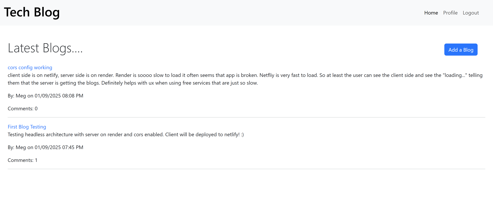
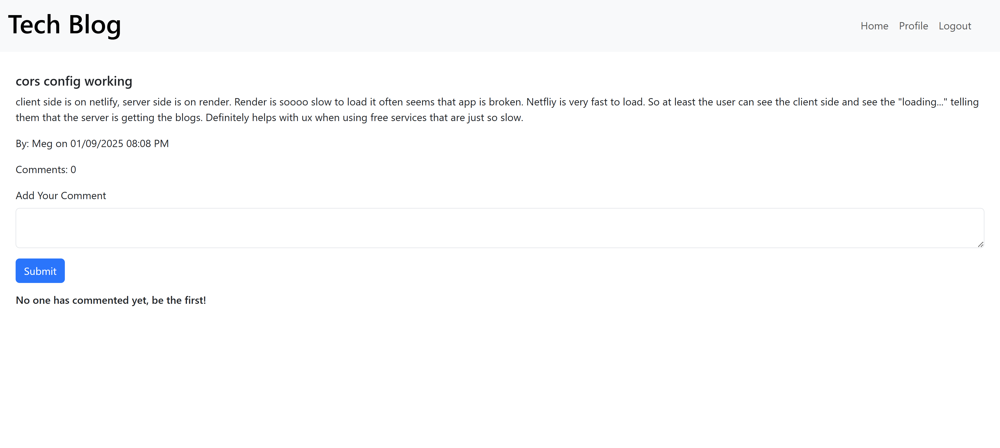
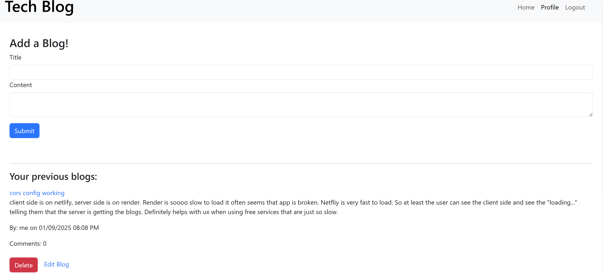

# Tech Blog

         

## Description ✏️

A quick and simple blogging application built in TypeScript, React, and Apollo GQL with 1 level of comments. The focus here was not on CSS, so it's minimal. The app uses JWT authentication and Outlet context provided by react router dom to check loggedIn status when needed. An auth guard component protects the profile route. 

Currently using refetch functionality for updating the DOM but intend to switch to the Apollo cache. 

The app was deployed on render, but render is just too slow, so I put the client on Netlify and the server on Render so that at least the UX is better and the user can see the website and see that the server is loading. On Render, it often just appears that the app is broken due to the very long loading time. 

To see the server code:
[Server on GitHub](https://github.com/femke77/Apollo-Mongo-Blog-Server)

## Table of Contents 📖

[Installation](#installation)

[Usage](#usage)

[Issues](#known-issues)

[Contributing](#how-to-contribute)

[Tests](#tests)

[Credits](#credits)

[Questions](#questions)

## Installation

Clone this repo, which is the client, and then go to https://github.com/femke77/Apollo-Mongo-Blog-Server and clone the server. 
To install necessary dependencies, run the following command:

```
npm i
```
on each code base. Run the server using 
```
npm run build && npm start
```
then run the client using
```
npm run dev
```
OR you can build the client too and run preview mode:
```
npm run build && npm run preview
```

## Usage

#### Dev Usage
After installation, navigate to the localhost port (3000) with your browser. Introspection available at 3001/graphql.

#### Deployed Usage
To use the deployed application simply go to https://apollo-mongo-blogging.netlify.app and signup to create blogs or comment on existing blogs.

To use an existing account for testing:
```
email: meg123@test.com
password: 12345678
```

### Deployed Link

[Click here to go to deployed project](https://apollo-mongo-blogging.netlify.app)

Keep in mind Render is very slow so you you will see initial fetch times of 50+ seconds to get blogs or be able to signup/login.

### Screenshots






---

## Known Issues

- Need pagination implementation
- Client code is not as componentized as it should be i.e. no Comment or CommentList
- Apollo cache should be used in place of refetch

## How To Contribute

Fork the repository and make a pull request with your new code.

## Tests

To run tests, run the following command:

```

```

## Credits

Bootstrap and React Bootstrap for quick and simple styling.

## Questions

If you have any questions about the repo or notice any bugs you want to report, open an issue or contact me directly at megan.meyers.388@gmail.com.
